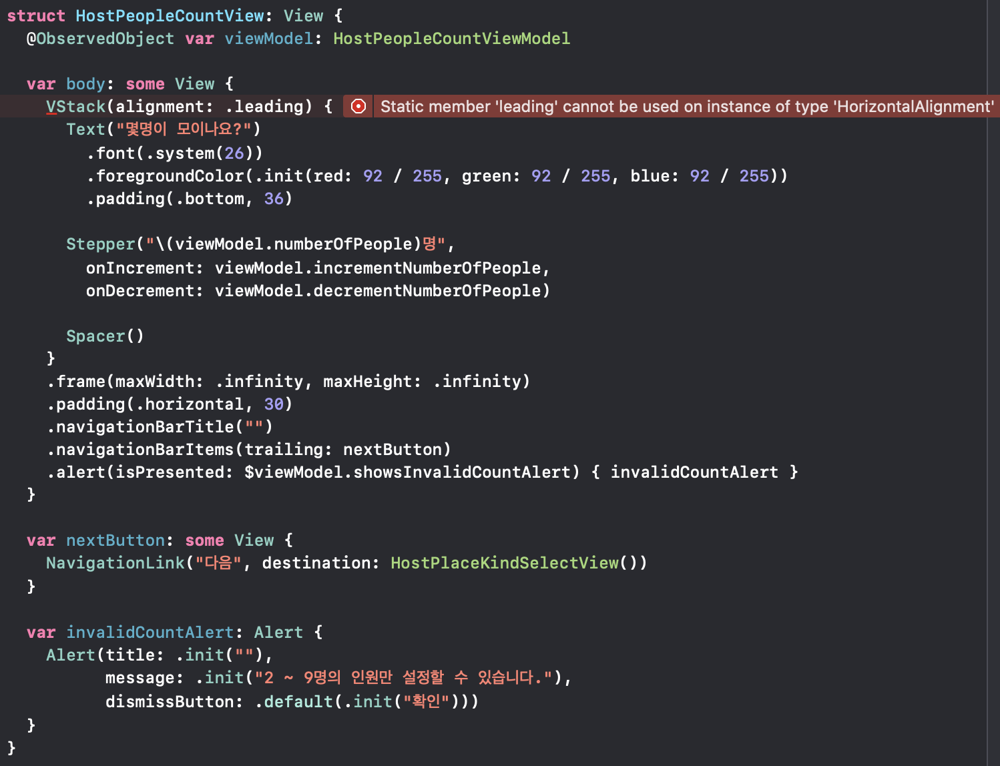

# SwiftUI를 사용하지 못한 이유

## 시작

우리 팀 iOS 개발자 모두 면접 때 SwiftUI로 프로젝트를 해보고 싶다고 하여 같은 팀이 되었다.

그래서 SwiftUI를 사용하여 프로젝트를 진행하고 있었으나 다음과 같은 이유로 사용하지 않기로 하였다.

## 문제

### 코드 인덱싱이 수시로 깨진다.

- 다양한 이유로 인해 코드 인덱싱이 깨진다.
  - 에러가 이상한 곳에 표시되는 컴파일 에러 발생시
  - Modifier가 많이 붙거나 계층 구조가 복잡해지는 등 View가 복잡해질 때
    - 그렇다고 엄청 복잡한 것도 아니고, 조금만 살을 붙이면 이렇게 된다
  - 자동 완성이 되지 않으므로 생산성이 매우 저하된다.
    - 이게 IDE냐? 에디터지.

### 컴파일 에러가 발생한 지점을 올바르게 알려주지 않는다.

- 디버깅하기 매우 어렵다. 결과적으로 개발 속도가 저하된다.



위의 코드에서 실제로 에러가 발생한 라인은 어디일까?

### 컴파일 속도가 매우 느리다.

- 위의 현상이 발생할 때 컴파일 속도가 매우 느려진다.
- 같은 프로세스가 여러 개 생성되어 CPU도 엄청 돌아가는 모습을 확인할 수 있다.

위의 세 문제는 서로 연결되어 복합적으로 발생한다. 언제 어디서 생산성을 저하시키는 요소가 등장할지 알 길이 없다.

### 불안정하다.

- 다음과 같은 시나리오에서 앱이 크래시나는 것을 확인함

  1. 내비게이션 바에 탭하면 push하는 내비게이션 바 아이템을 추가함

     ```swift
     ...
     .navigationBarItems(trailing: NavigationLink("다음", destination: NextView()))
     ...
     ```

  2. 이 버튼을 탭하여 push된 뷰에서 자동 생성된 백 버튼을 눌러 pop이 일어남

  3. pop 애니메이션이 종료하면 크래시 발생

- https://forums.developer.apple.com/thread/124757

  - 다른 사람들도 많이 겪은 문제

- 이 문제가 발생하고 나서 SwiftUI를 사용할 수 없겠다고 결론을 내림
